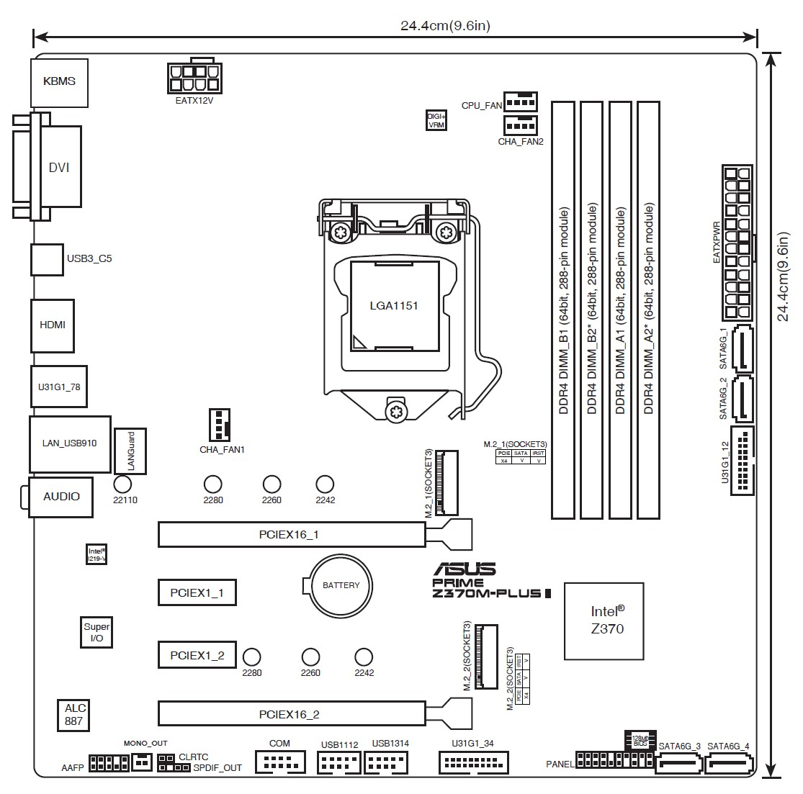

# Opencore-EFI-Z370M-5700XT-Catalina
verified working EFIs for installing and running MacOS Catalina 10.15.1 version 19B88, on Asus Z370M Plus II.
`Opencore-0.9.9` EFI for Hackintosh `10.15.1-Catalina` install/boot.

# 主板接口图 Motherboard plugs graph

# 硬件 Hardware Specification
The total worth of this hackintosh is ￥2876 ($398 USD)

| Part | Model | Details |
| ----- | ----- | ----- | 
| 主板 Motherboard | [华硕 Asus Z370M Plus II](https://www.asus.com.cn/motherboards-components/motherboards/prime/prime-z370m-plus-ii/techspec/) | USED |
| CPU | [Intel 8600K](https://www.intel.cn/content/www/cn/zh/products/sku/126685/intel-core-i58600k-processor-9m-cache-up-to-4-30-ghz/specifications.html) | OEM USED |
| iGPU | Intel UHD 630 | Integrated |
| GPU | [AMD RX 5700XT Sapphire Nitro+](https://www.sapphiretech.com/en/consumer/nitro-radeon-rx-5700-xt-8g-gddr6hao) | [超白金OC](https://www.sapphiretech.com/zh-cn/consumer/nitro-rx-5700xt-8g-g6-oc_c) USED |
| RAM | 丁凌存储 3200MHz DDR4 32G | 海力士Hynix颗粒 |
| SSD | WD SN550 HBM 1T | Old controller |
| SSD | GUDGA 128G | for Win11 USED |
| 电源 Power | 玄武550 | Rated 600W |
| 网卡 NetAdapter | [BCM94360CD](https://cn.fenvi.com/product_detail_27.html) | USED |

# 使用说明 Files and usage
| File | Comments | 
| --- | --- |
| EFI-catalina-UHD-installer | 安装盘所用 for USB-sitck Installer |
| EFI-catalina-5700XT-active | 双显可用 iGPU+dGPU |
| Tools/VDADecoderChecker | Mac下检测硬件加速工作状态。Opencore上的那一份不好使，段错误，这个是其他渠道下载的，实测可用 |
| Tools/gfxutil | Mac下检测图形设备PCIE路径信息`gfxutil -f GFX0` |
| Tools/forbit-sleep.sh | 关闭所有自动休眠睡眠，仅锁屏后熄灭屏幕 |

其中，`EFI-catalina-UHD-installer` 安装时插iGPU核显，否则乱显无法安装。
`EFI-catalina-UHD-installer` 安装时是紫屏，是还未打缓冲帧+屏幕补丁的缘故，这个补丁需要安装成功后根据你自己的核显+屏幕+插口情况使用Hackintool定制。
安装完可以用`EFI-catalina-5700XT-active`覆盖系统EFI，并将屏幕插入5700XT，一切显示正常。

Please connect to the HDMI on-board when installing using `EFI-catalina-UHD-installer` EFI, to avoid artifact-messed rendering on 5700XT. You may encounter purple colored UI which is fine. You can patch the framebuffer and EDID later according to your iGPU model and display hardware.
After install, replace system EFI with `EFI-catalina-5700XT-active` and now you can plug to the dGPU 5700XT.  

### 目前的体验 Current performance
- [x] Apple ID 登录正常
- [x] iCloud 全部服务正常，AppStore正常。
- [x] AriDrop 正常
- [x] 西部数据SSD完全正常
- [x] 锁屏解锁体验正常，锁屏熄屏正常。主机不睡眠，锁屏后自动休停屏幕，体验正常。
- [x] 开关机流程顺畅，工作正常。无`safe-mode`警告。
- [x] Safari、Firefox浏览器正常，看视频正常，硬件加速默认开启，无错误。
- [x] USB口均正常。
- [x] 蓝牙连音响、连键盘正常
- [x] 妙控板2的蓝牙/有线均正常
- [x] 速度完爆一切macbook pro，同时开20个sketch大文件画图，完全流畅毫无卡顿。
- [x] 自购SSD太划算了，Nvme 1TB才三百来块，速度快的飞起，反观Apple，无语。
- [ ] 深度睡眠hibernate和浅睡唤醒Darkwake均设置为禁止。不差这点休眠电费。休眠写sleep image还很浪费固态寿命。

### 详细说明 BIOS+USB Details
- 关于BIOS
    - 关闭vt-d
    - 关闭usb s5唤醒
    - 关闭快速启动
    - 关闭安全启动
    - 关闭串口
    - 关闭网络唤醒等各类唤醒
    - 启动类型=其他操作系统
    - 关闭 Resizable Bar
    - 开启大于4G寻址
    - 北桥-开启核显
    - 北桥-核显分配内存=1024MB
    - 北桥-首选显卡=自动
    - 开启内存XMP
    - 其他更细致的设定，请遵循[Opencore](https://dortania.github.io/OpenCore-Install-Guide/config.plist/coffee-lake.html#starting-point)针对Coffeelake-CPU的建议
- 关于USB安装盘
    - 使用了USB3盘，镜像加载速度明显提升。
    - 从mac上下载了Ventura的安装dmg，大小12GB，在mac下使用命令制作了完整系统的安装U盘
    - 尝试过Opencore推荐的macrecovery小镜像，只有673MB，但是完整系统需要联网下载，网速越来越慢，要至少48小时，中国区果友可以直接放弃这种在线安装思路。
- 关于主板USB口
    - 使用`USBToolBox.kext`,`UTBMap.kext`映射端口
    - 如果你插的主板口不是我提到的`U31G1_34`和`USB1314`，则应该自行下载 `USBToolBox` 的程序工具，重新映射端口，并生成你自己的 `UTBMap.kext`，替换本仓库EFI中的 `UTBMap.kext`。

### config.plist 设置详细说明
| Key | Value | Details |
| --- | --- | --- |
| Booter->Quirks |  |  |
| DevirtualiseMmio | False | 解决AsusZ370m[卡EB-stall黑屏](https://dortania.github.io/OpenCore-Install-Guide/troubleshooting/extended/kernel-issues.html#stuck-on-eb-log-exitbs-start) |
| EnableWriteUnprotector | True | 解决AsusZ370m[卡EB-stall黑屏](https://dortania.github.io/OpenCore-Install-Guide/troubleshooting/extended/kernel-issues.html#stuck-on-eb-log-exitbs-start) |
| ProtectUefiServices | False | Z370:false 不需要  |
| SetupVirtualMap | True | 解决AsusZ370m[卡EB-stall黑屏](https://dortania.github.io/OpenCore-Install-Guide/troubleshooting/extended/kernel-issues.html#stuck-on-eb-log-exitbs-start) |
| SyncRuntimePermissions | False | 解决AsusZ370m[卡EB-stall黑屏](https://dortania.github.io/OpenCore-Install-Guide/troubleshooting/extended/kernel-issues.html#stuck-on-eb-log-exitbs-start) |
| DeviceProperties->Add |  |  |
| PciRoot(0x0)/Pci(0x1b,0x0) | layout-id=01000000 | [I219V](https://www.asus.com.cn/motherboards-components/motherboards/prime/prime-z370m-plus-ii/techspec/)支持layout-1 |
| PciRoot(0x0)/Pci(0x2,0x0) | AAPL,ig-platform-id=07009B3E | 允许iGPU用于显示 |
| PciRoot(0x0)/Pci(0x2,0x0) | framebuffer-con1-type=00080000 | con1对应主板背部HDMI接口，应设为08才能正常显示颜色，否则为紫色DVI错误信号。修正颜色后应再注入EDID强制纠正显示器的错误分辨率与长宽比 |
| Kernel->Quirks |  |  |
| AppleCpuPmCfgLock | True | 解决AsusZ370m[卡EB-stall黑屏](https://dortania.github.io/OpenCore-Install-Guide/troubleshooting/extended/kernel-issues.html#stuck-on-eb-log-exitbs-start) |
| AppleXcpmCfgLock | True | 解决AsusZ370m[卡EB-stall黑屏](https://dortania.github.io/OpenCore-Install-Guide/troubleshooting/extended/kernel-issues.html#stuck-on-eb-log-exitbs-start) |
| DisableIoMapper | True | 确保vt-d不影响, just in case. |
| DisableRtcChecksum | True | 辅助开机safe mode问题 有效 |
| XhciPortLimit | True | 解决引导中途停止问题 solves booting stalls |
| NVRAM->7C436110-AB2A-4BBB-A880-FE41995C9F82 |  |  |
| boot-args | -v | 详细log |
| boot-args | keepsyms=1 | 详细log |
| boot-args | debug=0x100 | 详细log |
| boot-args | agdpmod=pikera | required by 5700XT必须，否则引导黑屏 |
| boot-args | alcid=1 | 音频layout |
| PlatformInfo->Generic  |  |  |
| SystemProductName | iMac19,1 | 适合5700xt+8代CPU |
| UEFI->AFPS | | |
| MinDate | -1 | 过老系统引导检查 solves booting stallssolves booting stalls |
| MinVersion | -1 | 过老系统安装检查 solves booting stalls |
| UEFI->Quirks  |  |  |
| EnableVectorAcceleration | True | 解决开机引导卡死 solves booting stalls |
| ReleaseUsbOwnership | True | 解决安装重启卡死 solves rebooting stalls |
| UnblockFsConnect | False |  解决安装重启卡死 solves rebooting stalls |

# 特别提示 Special hints
自2020年起，大量带有独显的黑苹果+白苹果都遭遇了“绿屏、黑屏、突然重启”等故障，均报告自从Mojave升级到了Catalina，就开始出现显示相关的死机失灵。我在试验中也遇到了相同的几乎全部问题，最终从Ventura->Monterey->Catalina-19B88，才有效缓解了该问题。从而也证明了该类故障均是苹果系统软件问题，而非黑苹果硬件问题。
您可能因此缺陷遭遇如下问题：
1. 绿屏，黑屏
1. 看视频，绿黑死机
1. 用浏览器，绿黑死机
1. 用Office、绘图软件、webview小软件绿黑死
1. Kernel Panic Watchdog：WindowServer 无反应，死机重启并报错。
1. 睡眠唤醒后，很多程序打不开，并迅速绿黑死
1. 5700xt高负载爆显存并绿黑死
1. 5700xt无负载，突然绿黑死。
在Monterey和Ventrua下，上述故障平均每天8次。我降级至Catalina后，这些现象就几乎见不到了，目前正在延长观察时间。

Since 2020, massive users have been reporting "Green/Black death or restart" using both Apple and Hackintosh-PC. Problems were seen most from the update Mojave->Catalina-15.2 and higher. I also observed nearly all those bugs and problems. Now it seems Catalina 10.15.1-19B88 can be a much stabler choice comparing with 11,12,13 or 14. 
Most importantly, with a working Catalina found, the fault is now eventually on Apple's MacOS itself, rather than any part of my PC-hardware.

This potential OS-borne flaw can cause:
1. The infamous Green and/or Black screen of death.
1. Green/black death during video.
1. Green/black during web-browsing.
1. Green/black when using Office, graphic soft or webview program.
1. Kernel Panic Watchdog：WindowServer not responding in 120 seconds.
1. Apps failed to function after any kind of sleep.
1. dGPU full load then crash.
1. dGPU idle and then crash.

I could steadily encounter aforementioned crashes 8 times in a day. But now Catalina 19B88 can work across the day without a single crash (tested under the same cpu+gpu work-load.)

# Appendix
- 下载各个版本的 MacOS downloads：https://support.apple.com/zh-cn/102662